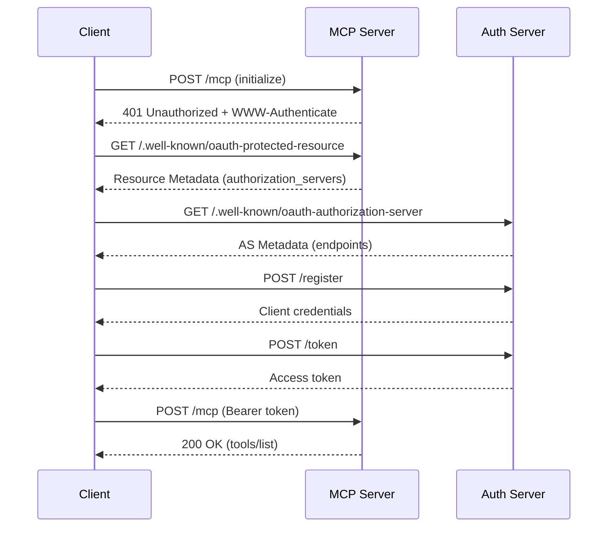

[](https://pub.dev/packages/genkit_mcp)

**MCP (Model Context Protocol) integration for Genkit Dart**

Expose Genkit tools, prompts, and resources as an MCP server, or connect to external MCP servers as a client — all with a unified API.

[Documentation](https://genkit.dev) • [API Reference](https://pub.dev/packages/genkit_mcp) • [MCP Specification](https://modelcontextprotocol.io)

---

## Installation

```bash
dart pub add genkit_mcp
```

## Overview

`genkit_mcp` provides three main components:

- **MCP Server** — Expose your Genkit actions (tools, prompts, resources) over the MCP protocol.
- **MCP Client** — Connect to a remote MCP server and use its tools, prompts, and resources.
- **MCP Host** — Manage multiple MCP server connections and aggregate their capabilities.


### Supported MCP Features (High-level)

- **As an MCP server** (`GenkitMcpServer`)
  - Tools, prompts, resources (including templates and subscribe/unsubscribe)
  - Completions (`completion/complete`)
  - Logging (`logging/setLevel`)
  - Tasks (`tasks/*`) and progress notifications
- **As an MCP client** (`GenkitMcpClient` / `GenkitMcpHost`)
  - Connect over stdio or Streamable HTTP
  - OAuth 2.1 authorization for protected Streamable HTTP servers
  - Discover and call tools, prompts, and resources from remote servers
  - Handle server-initiated requests for roots (`roots/list`)
  - Optional handlers for sampling (`sampling/createMessage`) and elicitation (`elicitation/create`)
  - Task lifecycle support for long-running inbound requests (client-side `tasks/*`)

### Supported Transports

- **Stdio** — Standard input/output (for CLI tools and subprocess-based servers)
- **Streamable HTTP** — HTTP with Server-Sent Events (for web-based deployments)

---

## MCP Host

To connect to one or more MCP servers, use the `defineMcpHost` function. This returns a `GenkitMcpHost` instance that manages connections to the configured MCP servers and registers their tools, prompts, and resources as Genkit actions.

```dart
import 'package:genkit/genkit.dart';
import 'package:genkit_mcp/genkit_mcp.dart';

void main() async {
  final ai = Genkit();

  // Each key (e.g., 'fs', 'memory') becomes a namespace for the server's tools.
  final host = defineMcpHost(
    ai,
    McpHostOptionsWithCache(
      name: 'my-host',
      mcpServers: {
        'fs': McpServerConfig(
          command: 'npx',
          args: ['-y', '@modelcontextprotocol/server-filesystem', '.'],
        ),
        'memory': McpServerConfig(
          command: 'npx',
          args: ['-y', '@modelcontextprotocol/server-memory'],
        ),
      },
    ),
  );

  final tools = await host.getActiveTools(ai);
  for (final tool in tools) {
    print('Tool: ${tool.name}');
  }
}
```

### `McpHostOptionsWithCache` Options

- **`name`**: (required) A name for the MCP host plugin.
- **`cacheTtlMillis`**: (optional) Cache TTL in milliseconds for tool/prompt/resource listings.
- **`version`**: (optional) Version string for this host.
- **`mcpServers`**: (optional) A map where each key is a namespace for an MCP server, and the value is its `McpServerConfig`.
- **`rawToolResponses`**: (optional) When `true`, tool responses are returned in their raw MCP format.
- **`roots`**: (optional) Roots to advertise to servers that request `roots/list`.

---

## MCP Client (Single Server)

To connect to a single MCP server and register its tools, prompts, and resources in the Genkit registry, use `defineMcpClient`. This is the recommended approach — it mirrors `defineMcpHost` and enables registry-based action discovery.

```dart
import 'package:genkit/genkit.dart';
import 'package:genkit_mcp/genkit_mcp.dart';

void main() async {
  final ai = Genkit();

  final client = defineMcpClient(
    ai,
    McpClientOptionsWithCache(
      name: 'my-client',
      mcpServer: McpServerConfig(
        command: 'npx',
        args: ['-y', '@modelcontextprotocol/server-filesystem', '.'],
      ),
    ),
  );
  await client.ready();

  // Tools are automatically available through the registry.
  final tools = await client.getActiveTools(ai);
  for (final tool in tools) {
    print('Tool: ${tool.name}');
  }
}
```

If you need manual control over the client lifecycle without registry integration, use `createMcpClient` instead:

```dart
final client = createMcpClient(McpClientOptions(
  name: 'my-client',
  mcpServer: McpServerConfig(
    command: 'npx',
    args: ['-y', '@modelcontextprotocol/server-filesystem', '.'],
  ),
));
await client.ready();

final tools = await client.getActiveTools(ai);
```

### `McpClientOptions`

- **`name`**: (required) A unique name for this client instance.
- **`serverName`**: (optional) Overrides the name used when prefixing tools/resources returned by `getActiveTools()` / `getActiveResources()`.
- **`version`**: (optional) Version string for this client.
- **`rawToolResponses`**: (optional) When `true`, tool responses are returned in their raw MCP format. Defaults to `false`.
- **`mcpServer`**: (required) A `McpServerConfig` with one of the following:
  - **`command`** + **`args`**: Launch a local server process via stdio transport.
  - **`url`**: Connect to a remote server via Streamable HTTP transport.
  - **`transport`**: Provide a custom `McpClientTransport` instance.
  - **`authProvider`**: (optional) An `OAuthClientProvider` for OAuth 2.1 authorization (Streamable HTTP only). See [Authentication](#authentication-oauth-21).
- **`samplingHandler`**: (optional) Handler for server-initiated sampling requests.
- **`elicitationHandler`**: (optional) Handler for server-initiated elicitation requests.
- **`notificationHandler`**: (optional) Handler for server notifications.
- **`cacheTtlMillis`**: (optional, `McpClientOptionsWithCache` only) Cache TTL in milliseconds for the registry plugin.

---

## Authentication (OAuth 2.1)

When connecting to a protected MCP server over Streamable HTTP, the client can perform OAuth 2.1 authorization automatically. The transport handles the entire flow — token injection, 401/403 retry, token refresh, and scope upgrades — so your application only needs to implement the `OAuthClientProvider` interface.

### How it works



1. The client sends a request to the MCP server.
2. The server responds with **401 Unauthorized** and a `WWW-Authenticate: Bearer` header.
3. The client discovers the authorization server (RFC 9728 / RFC 8414).
4. If needed, the client dynamically registers itself (RFC 7591).
5. The client obtains tokens (via `client_credentials`, `authorization_code` with PKCE, etc.).
6. The client retries the original request with the Bearer token.

### Implementing `OAuthClientProvider`

You provide an `OAuthClientProvider` that manages credentials, tokens, and (for interactive flows) user redirection.

#### Non-interactive flow (e.g. `client_credentials`)

For server-to-server communication where no user interaction is needed:

```dart
import 'package:genkit_mcp/genkit_mcp.dart';

class MyServiceAccountProvider extends OAuthClientProvider {
  OAuthClientInformation? _clientInfo;
  OAuthTokens? _tokens;

  @override
  Uri? get redirectUrl => null; // No redirect — non-interactive.

  @override
  OAuthClientMetadata get clientMetadata => const OAuthClientMetadata(
    redirectUris: [],
    grantTypes: ['client_credentials'],
    clientName: 'my-backend-service',
  );

  @override
  Future<Map<String, String>?> prepareTokenRequest(String? scope) async {
    final params = {'grant_type': 'client_credentials'};
    if (scope != null) params['scope'] = scope;
    return params;
  }

  @override
  Future<OAuthClientInformation?> clientInformation() async => _clientInfo;

  @override
  Future<void> saveClientInformation(OAuthClientInformation info) async {
    _clientInfo = info;
  }

  @override
  Future<OAuthTokens?> tokens() async => _tokens;

  @override
  Future<void> saveTokens(OAuthTokens tokens) async {
    _tokens = tokens;
  }

  @override
  Future<void> redirectToAuthorization(Uri url) async {
    throw UnsupportedError('Non-interactive flow');
  }

  @override
  Future<void> saveCodeVerifier(String v) async {}

  @override
  Future<String> codeVerifier() async => '';
}
```

Usage:

```dart
final client = createMcpClient(McpClientOptions(
  name: 'my-service',
  mcpServer: McpServerConfig(
    url: Uri.parse('https://mcp.example.com/mcp'),
    authProvider: MyServiceAccountProvider(),
  ),
));
await client.ready(); // Handles 401 → discovery → registration → token → retry
```

#### Interactive flow (e.g. `authorization_code` + PKCE)

For applications where a user must authorize via a browser:

```dart
class MyBrowserAuthProvider extends OAuthClientProvider {
  OAuthClientInformation? _clientInfo;
  OAuthTokens? _tokens;
  String? _codeVerifier;
  String? _state;

  @override
  Uri? get redirectUrl => Uri.parse('http://localhost:8080/callback');

  @override
  OAuthClientMetadata get clientMetadata => const OAuthClientMetadata(
    redirectUris: ['http://localhost:8080/callback'],
    grantTypes: ['authorization_code'],
    responseTypes: ['code'],
    clientName: 'my-app',
  );

  @override
  Future<String?> state() async {
    // Generate a random state for CSRF protection.
    return DateTime.now().microsecondsSinceEpoch.toRadixString(36);
  }

  @override
  Future<void> saveState(String state) async { _state = state; }

  @override
  Future<String?> savedState() async => _state;

  @override
  Future<void> redirectToAuthorization(Uri url) async {
    // Open the URL in the user's browser.
    print('Open this URL to authorize: $url');
  }

  @override
  Future<void> saveCodeVerifier(String v) async { _codeVerifier = v; }

  @override
  Future<String> codeVerifier() async => _codeVerifier!;

  // ... clientInformation, tokens, saveTokens, saveClientInformation ...
}
```

After the user completes authorization and is redirected back, call `finishAuth` on the transport:

```dart
final transport = await StreamableHttpClientTransport.connect(
  url: Uri.parse('https://mcp.example.com/mcp'),
  authProvider: MyBrowserAuthProvider(),
);

// ... user completes auth in browser, callback receives code and state ...

await transport.finishAuth(authorizationCode, state: returnedState);
```

### Security

The OAuth implementation includes the following protections:

- **SSRF defence**: Discovered URLs (resource metadata, token endpoint, registration endpoint) are validated to share the same origin as the MCP server. Override `isAuthorizationServerUrlAllowed()` on your provider to allow cross-origin authorization servers if needed.
- **CSRF protection**: The `state` parameter is saved before authorization and verified on callback via `finishAuth(code, state: ...)`. Implement `state()`, `saveState()`, and `savedState()` on your provider to enable this.
- **PKCE**: All authorization code flows use Proof Key for Code Exchange (S256) to prevent authorization code interception.
- **DoS protection**: OAuth HTTP requests enforce a 30-second timeout and a 1 MB response body size limit.

---

## MCP Server

Expose all tools, prompts, and resources from a Genkit instance as an MCP server.

```dart
import 'package:genkit/genkit.dart';
import 'package:genkit_mcp/genkit_mcp.dart';
import 'package:schemantic/schemantic.dart';

void main() async {
  final ai = Genkit();

  ai.defineTool(
    name: 'add',
    description: 'Add two numbers together',
    inputSchema: mapSchema(stringSchema(), dynamicSchema()),
    fn: (input, _) async {
      final a = num.parse(input['a'].toString());
      final b = num.parse(input['b'].toString());
      return (a + b).toString();
    },
  );

  ai.defineResource(
    name: 'my-resource',
    uri: 'my://resource',
    fn: (_, _) async {
      return ResourceOutput(content: [TextPart(text: 'my resource')]);
    },
  );

  ai.defineResource(
    name: 'file',
    template: 'file://{path}',
    fn: (input, _) async {
      return ResourceOutput(
        content: [TextPart(text: 'file contents for ${input.uri}')],
      );
    },
  );

  // Create and start the MCP server (stdio transport by default).
  final server = createMcpServer(ai, McpServerOptions(name: 'my-server'));
  await server.start();
}
```

### Streamable HTTP Transport

```dart
import 'dart:io';

final transport = await StreamableHttpServerTransport.bind(
  address: InternetAddress.loopbackIPv4,
  port: 3000,
);
await server.start(transport);
// Server is now available at http://localhost:3000/mcp
```

### `McpServerOptions`

- **`name`**: (required) The name your server will advertise to MCP clients.
- **`version`**: (optional) The version your server will advertise. Defaults to `"1.0.0"`.

---

## Namespacing

Actions can be namespaced to avoid conflicts (behavior depends on whether you use a host plugin or a single client):

- **`defineMcpHost` / `McpHostPlugin`**: Actions are exposed as `hostName/serverKey:actionName` (e.g., `my-host/fs:read_file`).
- **`GenkitMcpClient.getActiveTools()` / `getActiveResources()`**: Actions are named `client.serverName/actionName`.
  - `client.serverName` defaults to the remote server's `initialize.serverInfo.name` (if provided), otherwise `McpClientOptions.serverName`, otherwise `McpClientOptions.name`.
  - Set `McpClientOptions.serverName` if you want a stable prefix independent of the remote server's self-reported name.
- **Prompts in `GenkitMcpClient.getActivePrompts()`** keep their original MCP prompt names (no automatic prefixing). If you need strict namespacing across multiple servers, use a `GenkitMcpHost`.

---

## Tool Responses

MCP tools return a `content` array as opposed to a structured response like most Genkit tools. The plugin attempts to parse and coerce returned content:

1. If **all** `content` parts are text, they are concatenated into a single string.
   - If the concatenated text *looks like JSON* (starts with `{` or `[` after left-trimming), the client tries `jsonDecode(...)` and returns the decoded object/list on success.
   - Otherwise the concatenated text is returned as a `String`.
2. If `content` has exactly one **non-text** part, that part map is returned (e.g. an image/audio block).
3. If `content` has multiple or mixed parts, the raw MCP result map is returned.
4. If the MCP result contains `isError: true`, the processed value is returned as `{'error': '<text>'}`.

Set `rawToolResponses: true` in client options to skip this processing and receive raw MCP responses.

---

## Known Limitations

- MCP prompts only accept **string (and nullable string) parameters**, so prompt input schemas must be objects with only string (or null) property values.
- MCP prompt message roles only support **`user`** and **`assistant`** (Genkit `Role.user` / `Role.model`). `system` is not supported.
- Media in prompts/resources must be provided as **base64 data URLs** (`data:<mimeType>;base64,<data>`). HTTP/HTTPS URLs are rejected.
- Resource templates only support **simple `{var}`** substitutions (no URI-template operators like `{+path}`).

---

## Testing Your MCP Server

You can test your MCP server using the official [MCP Inspector](https://github.com/modelcontextprotocol/inspector).

### Stdio server

If your server uses the stdio transport (the default), launch the inspector with the command and arguments separated:

```bash
# During development (replace with your entrypoint)
npx @modelcontextprotocol/inspector dart run bin/server.dart

# With a compiled binary
npx @modelcontextprotocol/inspector ./my_mcp_server
```

> **Note:** The MCP Inspector is a Node.js tool. You need `npx` (from Node.js) installed to use it. It launches your Dart server as a subprocess and communicates via stdio.

### Streamable HTTP server

If your server uses the Streamable HTTP transport, start your server first, then connect the inspector to its URL:

```bash
# Start your server (replace with your entrypoint)
dart run bin/server.dart

# In another terminal, open the inspector and connect to the URL
npx @modelcontextprotocol/inspector
# Then enter the server URL (e.g., http://localhost:3000/mcp) in the inspector UI.
```

Once the inspector is connected, you can list tools, prompts, and resources, and test them interactively.

---

## Protocol Version

This package implements the MCP specification version **2025-11-25**.

---

Built by [Google](https://firebase.google.com/) with contributions from the [Open Source Community](https://github.com/genkit-ai/genkit-dart/graphs/contributors).
